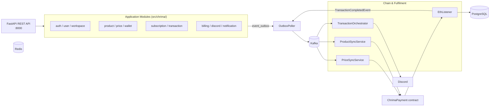
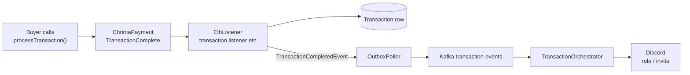

[](https://www.python.org/downloads/release/python-3130/)

# Chrima

Chrima is an open-source backend for selling access to Discord communities via on-chain USDT payments. Server owners create workspaces, products, and prices; buyers pay on-chain; and Chrima automatically fulfils access by assigning Discord roles or inviting members. It is built as an event-driven FastAPI service using the outbox pattern for reliable asynchronous processing.

## Features

- **On-chain payments** - the `ChrimaPayment` smart contract accepts USDT and emits a `TransactionComplete` event
- **Automated Discord fulfilment** - grant roles or invite members to a server once a transaction completes
- **Workspace & product management** - CRUD for workspaces, products, prices, wallets, and tokens
- **Subscriptions** - recurring prices with balance tracking and expiry notifications
- **Stripe billing** - platform-tier checkout sessions with webhook handling
- **Event-driven architecture** - outbox pattern with Kafka for reliable asynchronous event processing
- **Pluggable notifications** - Discord and email (Brevo) channels with templated messages
- **Observability** - OpenTelemetry instrumentation with Prometheus metrics, Loki logs, and Tempo traces
- **CLI** - Click-based tool to run the API, sync services, listeners, pollers, and migrations

## Architecture

Chrima is organised into three layers: the **REST API** (`src/chrima/api/`), the **application modules** (`src/chrima/<domain>/`), and the **event pipeline** that links them to the chain and to Discord.



### REST API (`src/chrima/api/`)

FastAPI application providing the HTTP API layer. Dependencies are constructed in the `lifespan` and registered in an `ObjectRegistry`, which is used to inject services into routers. Routes are organised by domain:

| Router         | Prefix           | Purpose                                    |
| -------------- | ---------------- | ------------------------------------------ |
| `auth`         | `/auth`          | Login, register, JWT tokens, Discord OAuth |
| `user`         | `/users`         | User management and platform tiers         |
| `workspace`    | `/workspaces`    | Discord server workspaces                  |
| `product`      | `/products`      | Products (role or invite fulfilment)       |
| `price`        | `/prices`        | Prices (one-time or recurring)             |
| `wallet`       | `/wallets`       | Payment wallets                            |
| `subscription` | `/subscriptions` | Subscription balances and status           |
| `transaction`  | `/transactions`  | Read-only transaction records              |
| `billing`      | `/billing`       | Stripe checkout sessions and subscriptions |
| `discord`      | `/discord`       | Query guilds, channels, and roles          |
| `analytics`    | `/analytics`     | Analytics endpoints                        |
| `tokens`       | `/tokens`        | ERC20 token metadata                       |
| `monitoring`   | `/monitoring`    | Prometheus metrics                         |

### Application Modules (`src/chrima/`)

Each domain module follows a consistent structure: `model.py` (SQLAlchemy), `schema.py` (Pydantic), `service.py` (business logic), `router.py` (FastAPI endpoints), and `exception.py` (domain errors).

| Module          | Key Contents                                                                               |
| --------------- | ------------------------------------------------------------------------------------------ |
| `auth/`         | `AuthService` - login/register, Argon2 password hashing, JWT issuance, Discord OAuth       |
| `user/`         | `UserService` - user CRUD and tier management                                              |
| `workspace/`    | `WorkspaceService` - Discord server workspaces and notification channel config             |
| `product/`      | `ProductService`, `ProductSyncService` - products and on-chain recipient sync              |
| `price/`        | `PriceService`, `PriceSyncService` - prices and on-chain amount sync                       |
| `wallet/`       | `WalletService` - wallet address management                                                |
| `subscription/` | `SubscriptionBalanceService`, `SubscriptionExpiryChecker` - recurring balances and expiry  |
| `transaction/`  | `TransactionService` (read-only), `EthListener`, `TransactionOrchestrator`                 |
| `billing/`      | `BillingService`, `StripeBillingProvider`, `StripeBillingWebhookListener`                  |
| `discord/`      | `DiscordService`, `DiscordMembershipService`, `DiscordBot`                                 |
| `notification/` | `NotificationPublisher`, `NotificationPoller`, Discord/email channels and template engines |
| `email/`        | `BrevoEmailService` - transactional email delivery                                         |
| `analytics/`    | `AnalyticsService`                                                                         |
| `tokens/`       | `TokenService` - ERC20 token metadata (name, standard, chain, address)                     |
| `jwt/`          | `JWTService` - token encode/decode                                                         |
| `encryption/`   | `EncryptionService` - symmetric encryption of secrets (e.g. Discord access tokens)         |
| `event_bus/`    | `OutboxEventPublisher`, `OutboxPoller`, `EventPublisher` ABC                               |
| `monitoring/`   | Metrics middleware, tracing decorators, `/monitoring` router                               |

## Event Pipeline (Outbox Pattern)

Reliable asynchronous processing uses the outbox pattern:

1. Services emit events via `EventPublisher`; `OutboxEventPublisher` persists them to the `event_outbox` table in the same DB transaction as the business operation
2. `OutboxPoller` periodically reads pending events, deserialises them with domain-specific deserialisers, and publishes them to Kafka topics
3. Consumers process the events and commit their Kafka offset only after success

| Event                    | Topic                 | Consumer                    | Action                                     |
| ------------------------ | --------------------- | --------------------------- | ------------------------------------------ |
| `price.updated`          | `price-events`        | `PriceSyncService`          | `setPrice` on `ChrimaPayment`              |
| `product.wallet_updated` | `product-events`      | `ProductSyncService`        | `setProductRecipient` on `ChrimaPayment`   |
| `transaction.completed`  | `transaction-events`  | `TransactionOrchestrator`   | Assign Discord roles or invite members     |
| `subscription.*`         | `subscription-events` | `SubscriptionExpiryChecker` | Expiry notifications (periodic, DB-backed) |
| `billing.*`              | `billing-events`      | -                           | Billing lifecycle events                   |

### Transaction Flow

A payment progresses from the chain back into Discord through the pipeline:



1. The buyer calls `processTransaction(product_id, price_id, user_id)` on the contract, which pulls USDT via `transferFrom` and emits `TransactionComplete`
2. `EthListener` polls the chain, validates the product/price, persists a `Transaction` row, and publishes a `TransactionCompletedEvent`
3. `TransactionOrchestrator` consumes the event and fulfils access - `INVITE` products add the member to the guild, `ROLE` products assign the configured roles

## Smart Contracts

Contracts live at `src/resources/contract/`, with the Hardhat config at the same level. The compiled ABI is stored at `src/resources/ChrimaPayment.json`.

- `ChrimaPayment.sol` - USDT-only payment contract; owners set price amounts and product recipients, buyers trigger `IERC20.transferFrom`
- `TestUSDT.sol` - dev mock ERC20 with a public `mint()` (no access control)

```bash
# Compile
bunx hardhat compile
```

```bash
# Deploy
bunx hardhat run ./scripts/deploy.js --network sepolia
```

```bash
# Verify
bunx hardhat verify \
    --network sepolia \
    --constructor-args ./scripts/arguments.js \
    0x122D688D1690482f30Ab49bbB673266ac31f07Ab \
    --verbose
```

Deployed on Arbitrum Sepolia; EIP-1559 gas params (`maxFeePerGas`, `maxPriorityFeePerGas`) are required - plain `gasPrice` fails.

## CLI

The CLI is built with [Click](https://click.palletsprojects.com/) and invoked via `uv run python main.py` (from `src/`).

```bash
# Start the FastAPI REST API server
uv run uvicorn chrima.api.app:app --host 0.0.0.0 --port 8000

# Apply database migrations
uv run python main.py db upgrade

# Write the DB URL into alembic.ini
uv run python main.py alembic write

# Start the outbox poller (PostgreSQL -> Kafka)
uv run python main.py event-bus outbox run --interval 5 --batch-size 1000 --timeout 5

# Start the notification poller (PostgreSQL -> Discord/email)
uv run python main.py notification --interval 5 --batch-size 100 --timeout 30

# Sync prices to the chain (Kafka consumer)
uv run python main.py price sync run

# Sync product recipients to the chain (Kafka consumer)
uv run python main.py product sync run

# Listen for on-chain TransactionComplete events
uv run python main.py transaction listener eth --poll-interval 1

# Fulfil Discord access for completed transactions (Kafka consumer)
uv run python main.py transaction orchestrator

# Check for expiring/expired subscriptions and send notifications
uv run python main.py subscription expiry-checker run

# Run the Discord bot
uv run python main.py discord bot

# Seed the database
uv run python main.py seed
```

## Discord Integration

The Discord bot fulfils access (roles/invites) and delivers notifications.

### Bot Permissions

- Manage Roles
- Kick Members (dev)
- Send Messages

> The bot's role must be above all other roles which it'll have the power to grant.

### OAuth Scopes

- **Subscriber roles** - `identify`, `guilds.join`
- **Workspace owner roles** - `identify`, `guilds`

## Getting Started

### Prerequisites

- Python 3.13+
- [uv](https://docs.astral.sh/uv/) package manager
- Docker and Docker Compose
- A Discord application and bot token
- An Arbitrum Sepolia RPC URL, a deployed `ChrimaPayment` contract, and a funded signer private key

### Setup

```bash
# Install dependencies
uv sync

# Configure environment
cp .env.example .env
# Edit .env with your database, RPC, contract, and Discord credentials

# Start the stack (PostgreSQL, Redis, Kafka, API, workers, observability)
docker compose -f docker-compose.yaml -f docker-compose.ports.yaml up -d

# Apply database migrations
uv run python main.py db upgrade

# Start the API server
uv run uvicorn chrima.api.app:app --host 0.0.0.0 --port 8000
```

### Smart Contracts

```bash
# Install Hardhat dependencies and compile
cd src/resources/contract
bun install
bunx hardhat compile

# Deploy the payment contract
bunx hardhat run ./scripts/deploy.js --network sepolia
```

## Tests

### Test Infrastructure

Start the test containers (PostgreSQL, Redis, Kafka):

```bash
docker compose -p chrima-test -f docker-compose.infra.yaml --env-file .env.test up -d
```

### Running Tests

```bash
# Run all tests (skips integration tests - they require external infra)
uv run pytest --ignore=test/integration

# Run a single test
uv run pytest test/path/test_file.py::test_name

# Run tests with output (no capture)
uv run pytest -s test/path/test_file.py::test_name
```

Service and router tests hit a real PostgreSQL database (no SQLite in-memory mocks). Each test requests the `create_drop_tables` fixture to drop and recreate the schema for a fresh database per test. Integration tests under `test/integration/` use the real on-chain contract, Discord API, and Kafka - no mocking.
